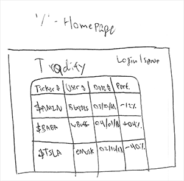
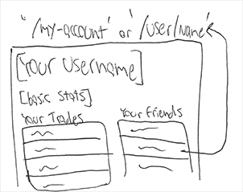
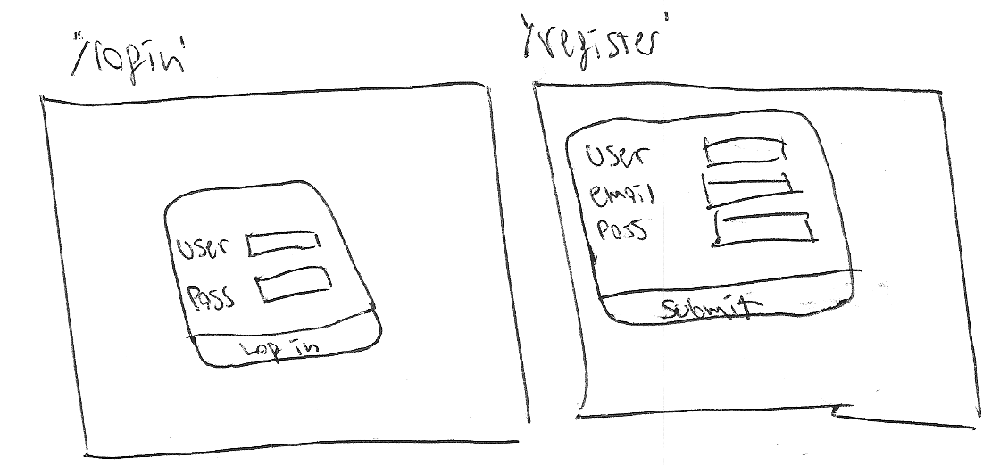
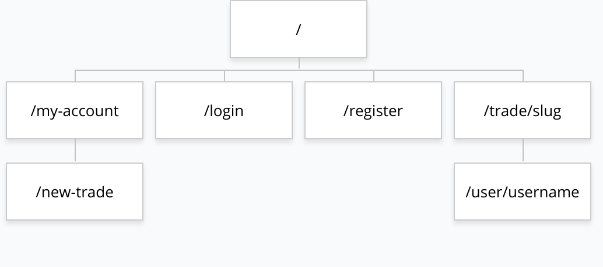

# Tradify

## Overview

Trading securities is an exercise in boredom, tapping away at your brokerage's application in the vain hope of deriving profit from the enigmatic juggernaut of global capitalism...but it doesn't have to be! Tradify introduces a social element to investing for those who don't have a reserved parking spot at the country club, allowing users to post their trades or speculative thoughts and comment on the activity of others. Keep up-to-date your friends and engage in the *good* kind of trade-war by competing for the best picks and maximum profit.

Tradify is a web-app that will allow users to post paper trades that are visible to others. The application will track and display the performance of these trades and other users will be able to provide comments on these activities. These trades are visible to the public, users will be able to create accounts and log-in so they can post their own and comment on others'.


## Data Model


The application will store Users, Trades and Comments

* Users can have multiple Trades (via references)
* Users can have multiple friends [other Users] (via references)
* each Trade can have multiple Comments (by embedding)

An Example User:

```javascript
{
  username: "wBuffett30",
  hash: // a password hash,
  trades: // an array of references to Trade documents,
  friends: // an array of references to other Users
}
```

An Example Trade with Embedded Comments:

```javascript
{
  user: // a reference to a User object,
  ticker: "BRK.A",
  priceAtCreation: 293436.94,
  action: "buy",
  confidence: "high",
  comments: [
    { name: [User reference], content: "Suggesting your own stock, really?"}
  ],
  createdAt: // timestamp,
  slug: //unique URL to trade info page
}
```


## [First Draft Schema](src/db.js)

## Wireframes

/ - index



/my-account - displaying info about your account, trades, and friends



/login & /register - pages for user account management



/new-trade - page for submitting a new paper trade


/trade/slug - page for displaying detailed information and comments about a trade


## Site map



Here's a [complex example from wikipedia](https://upload.wikimedia.org/wikipedia/commons/2/20/Sitemap_google.jpg), but you can create one without the screenshots, drop shadows, etc. ... just names of pages and where they flow to.

## User Stories or Use Cases

(___TODO__: write out how your application will be used through [user stories](http://en.wikipedia.org/wiki/User_story#Format) and / or [use cases](https://www.mongodb.com/download-center?jmp=docs&_ga=1.47552679.1838903181.1489282706#previous)_)

1. as non-registered user, I can register a new account with the site
2. as a non-registered user, I can view and sort trades
3. as a user, I can log in to the site
4. as a user, I can create a new trade
5. as a user, I can view all of the trades I've made
6. as a user, I can add comments to existing trades
7. as a user, I can add friends to follow
8. as a user, I can view my friends and their trades

## Research Topics

* (5 points) Integrate user authentication
    * Using passport for user auth

* (5 points) vue.js
    * Would like to use vue.js for this project, still tbd

10 points total out of 8 required points


## [Link to Initial Main Project File](app.js)


## Annotations / References Used

1. [IEX Market API](https://iextrading.com/developer/docs/)
